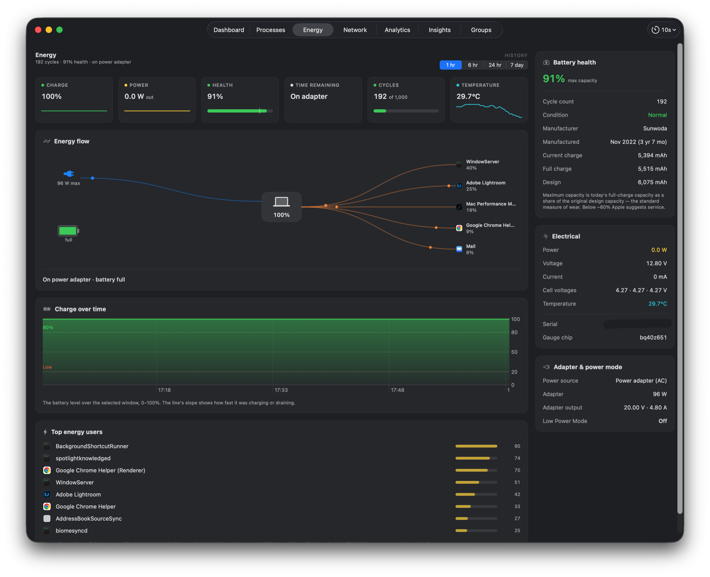
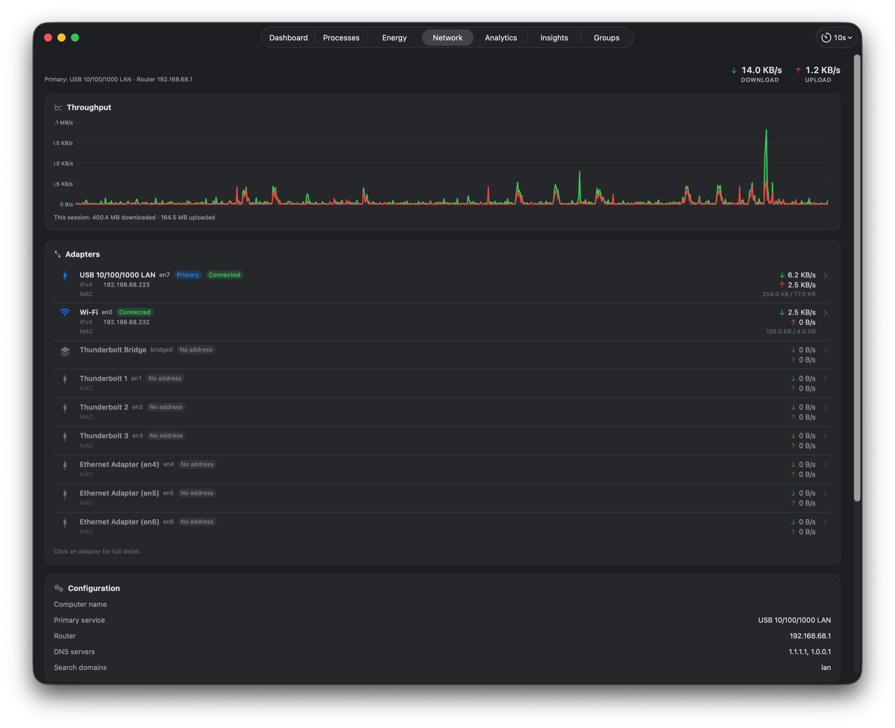
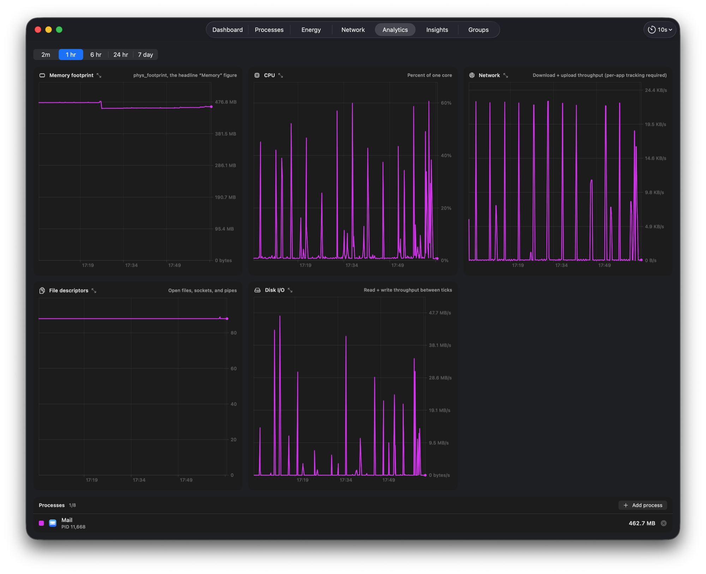
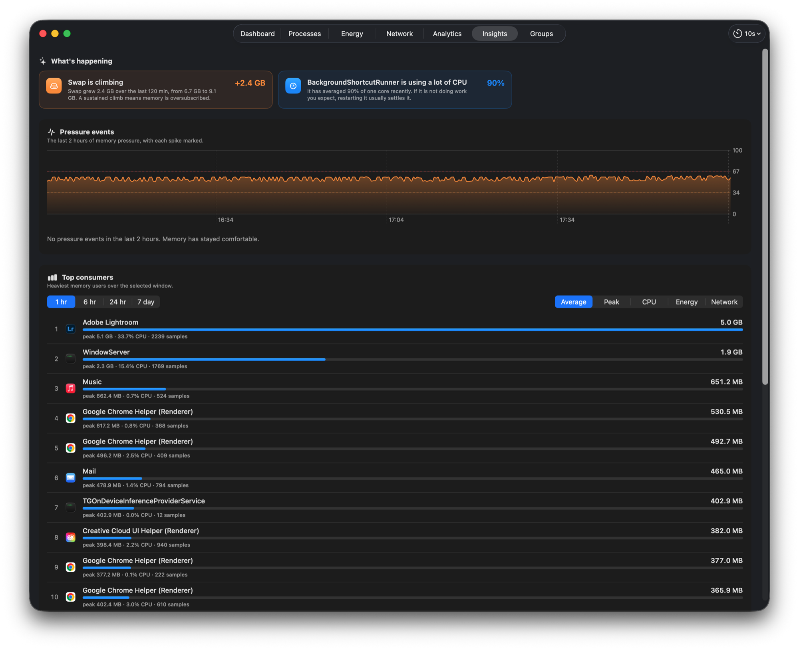

# Mac Performance Monitor

[](https://github.com/Zesty0wl/mac-performance-monitor/actions/workflows/ci.yml)

A native macOS **performance analyzer and logger** that lives in your menu bar. It
continuously records CPU, memory pressure, GPU, network, battery, and per-process
usage to a local database, then helps you make sense of it: trends, leaks, pressure
events, and on-device diagnostics.

Free and open source. No telemetry. Every sample stays on your Mac.


## Features

- **Menu bar at a glance:** live memory-pressure, CPU, GPU, network, and battery
  readouts, each with a quick popover.
- **Dashboard:** a plain-language verdict, headline tiles, the pressure timeline
  with selectable ranges, a memory breakdown, and a swap trend.
- **Process explorer:** a live, sortable, filterable table of every process, with a
  detail inspector for footprint, CPU, file descriptors, disk I/O, and Rosetta status
  over time.
- **Process groups:** group related apps and helpers into a stack and see its blended
  footprint as a share of the device.
- **History and logging:** configurable-resolution logging to a local SQLite store;
  top consumers over any window you pick.
- **Leak detection:** flags processes whose footprint climbs steadily, plus a log of
  pressure events over time.
- **Deep-dive diagnostics:** explains what a process is and whether its behavior is
  normal, using signed, updatable check packs.
- **Insights and alerts:** quiet-by-default notifications for critical pressure,
  sustained swap, per-process ceilings, and suspected leaks.

## Screenshots

Process explorer, with a per-process detail inspector:


Energy: battery health, an energy-flow view, and the top energy users:



Network throughput and every adapter on the machine:



Analytics: build your own per-process charts over any window:



Insights: what changed, pressure events, and the heaviest consumers:



## Install

Download `MacPerformanceMonitor.pkg` from the [Releases](../../releases) page and
double-click it. It's Developer ID signed and notarized by Apple, so it installs and
launches without security warnings, and keeps itself up to date via Sparkle.

### Build from source

```sh
git clone https://github.com/Zesty0wl/mac-performance-monitor.git
cd mac-performance-monitor
swift build
swift test
Scripts/run.sh
```

Requires macOS 15 (Sequoia) or later and a Swift 6 toolchain (Xcode 16 or a Swift.org
toolchain), on Apple silicon.

## Privacy

No telemetry, no analytics, no phone-home. Every sample is written to a local SQLite
database and never leaves your Mac. Being open source, anyone can audit exactly what
it does.

## Contributing

Contributions are welcome. See [CONTRIBUTING.md](CONTRIBUTING.md) and the
[Code of Conduct](CODE_OF_CONDUCT.md). Security reports go through
[SECURITY.md](SECURITY.md).

## License

Released under the [MIT License](LICENSE). Bundles
[GRDB.swift](https://github.com/groue/GRDB.swift) (MIT) and
[Sparkle](https://sparkle-project.org) (MIT).
