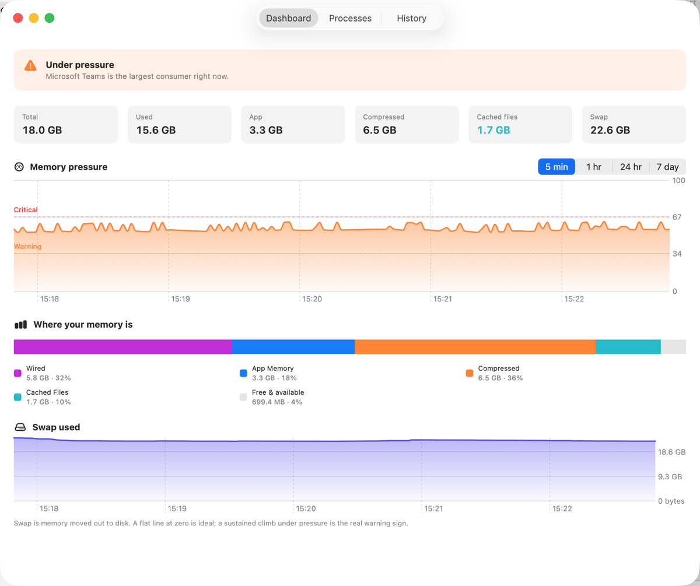
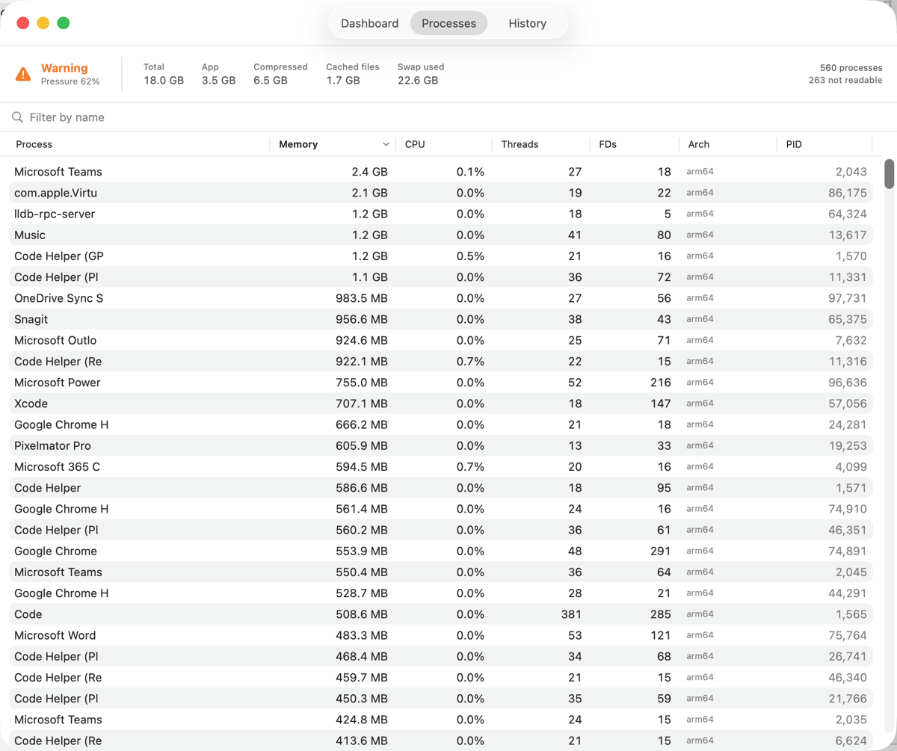
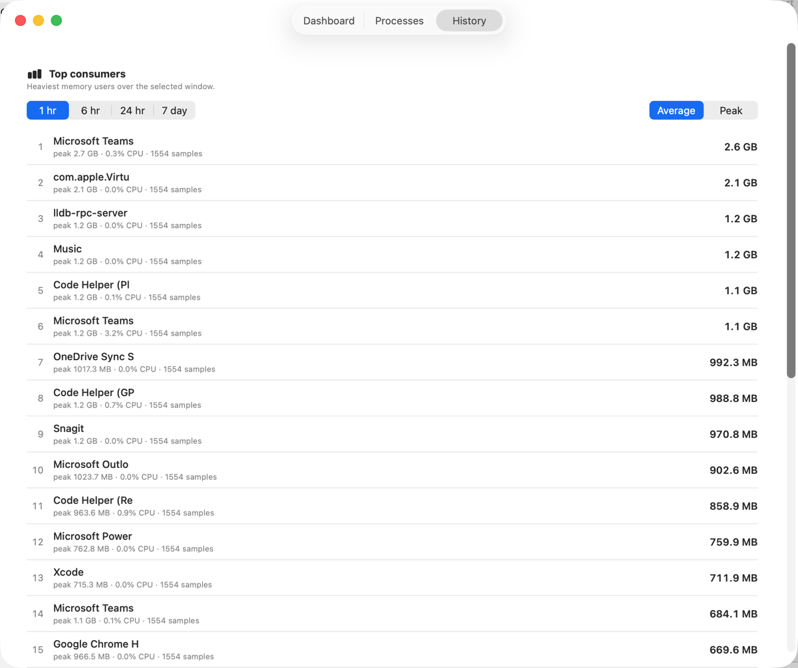

# MacPerfMonitor

[](https://github.com/Zesty0wl/mac-performance-monitor/actions/workflows/ci.yml)

**See where your memory actually goes.** MacPerfMonitor is a native macOS menu bar
utility that explains memory the way macOS really works: it leads with memory
*pressure*, not the misleading "free RAM" number, and points to the processes
that matter.

Open source, no telemetry, all data stays on your machine. Not sandboxed,
distributed as a notarised Developer ID app and as buildable source. Never
shipped through the Mac App Store.



## Free RAM is not the metric

On Apple silicon almost no RAM is ever "free", and that is completely normal.
macOS deliberately keeps memory busy: much of what looks "used" is cached file
data that can be reclaimed the instant something needs it. Watching the free
number go up and down tells you almost nothing.

What actually matters is **memory pressure**: how hard the system is working to
keep up with demand. When pressure stays high, macOS compresses memory and then
writes to swap. A little of that is fine. A lot, sustained, is the real signal
that something is asking for too much, and that is exactly what MacPerfMonitor
surfaces.

MacPerfMonitor turns the discrete pressure level into a smooth 0 to 100 index for
charting, annotates the timeline at real pressure transitions, and names the
process responsible. The exact index formula lives in
[docs/pressure-index.md](docs/pressure-index.md) so it can be audited.

## Features

- **Menu bar at a glance.** A template glyph that stays calm at normal pressure
  and tints as pressure rises, with a quick popover summary.
- **Pressure-first dashboard.** A plain-language verdict, headline tiles, the
  hero pressure timeline with selectable ranges, a memory taxonomy breakdown,
  and a swap trend.
- **Process explorer.** A live, sortable, filterable table of every process,
  with a detail inspector showing footprint, CPU, file descriptors, and disk
  I/O over time, plus Rosetta translation status.
- **History and leak detection.** Top consumers over time, a leak board that
  flags processes whose footprint climbs steadily, and a log of pressure events.
- **Insights and alerts.** Optional, quiet-by-default notifications for critical
  pressure, sustained swap, per-process ceilings, and suspected leaks, with
  edge-triggering and hysteresis so they do not spam you.
- **Honest about itself.** MacPerfMonitor samples its own process and shows its
  footprint in Settings. It holds well under a 60 MB budget while idle.
- **Private by design.** No telemetry, no analytics, no phone-home. Every sample
  stays in a local SQLite store on your machine.

## Screens

A live, sortable, filterable process table that is honest about what an
unprivileged app can read:



Top consumers over your chosen window, by average or peak footprint:



## Install

### Notarised installer

Download the latest notarised, stapled installer (`MacPerformanceMonitor.pkg`) from the
[Releases](../../releases) page and double-click it to install into Applications. Because
it is signed with a Developer ID and notarised by Apple, it installs and launches without
security warnings.

### Build from source

MacPerfMonitor builds with the Swift toolchain and needs no Apple Developer account.

```sh
git clone https://github.com/Zesty0wl/mac-performance-monitor.git
cd mac-performance-monitor

swift build          # compile
swift test           # run the test suite
Scripts/run.sh       # build, bundle, ad-hoc sign, and launch the app
```

`Scripts/run.sh --release` produces the optimised build. The bundle is ad-hoc
signed (`codesign -s -`) so it runs locally without a Developer ID certificate.

**Requirements:** macOS 15 (Sequoia) or later and a Swift 6 toolchain
(Xcode 16 or a Swift.org toolchain).

## Architecture

MacPerfMonitor is a Swift Package with a clean split between a pure data layer and the
SwiftUI app, so the analysis is testable headlessly and reusable.

| Target | Role |
| --- | --- |
| `CMacPerfMonitor` | Thin C shim over `libproc`, `mach`, and `sysctl`, plus Rosetta detection and `rusage_info_v6`. |
| `MacPerfMonitorCore` | The whole data layer: system readers, models, sampling, persistence (GRDB and SQLite), and analysis. No SwiftUI, fully unit tested. |
| `MacPerfMonitor` | The SwiftUI app: menu bar, windows, views, and view models. Depends only on `MacPerfMonitorCore`. |
| `macperfmonitor-cli` | A headless diagnostics and data-layer harness. |
| `MacPerfMonitorCoreTests` | The test suite for the data layer. |

There are two third-party dependencies: [GRDB.swift](https://github.com/groue/GRDB.swift)
(pinned in `Package.swift`), used for the local SQLite store, and
[Sparkle](https://sparkle-project.org) (vendored in `ThirdParty/`), used for
in-app auto-updates. Everything else is the platform.

Design notes live in [docs/](docs): the data-layer findings, the memory taxonomy
formulas, the pressure-index derivation, the performance budget, and the
onboarding and accessibility decisions.

## Privacy

MacPerfMonitor reads sensitive process data, so its trust story matters. It sends
nothing anywhere: no telemetry, no analytics, no network calls. All sampled data
is written to a local SQLite database and never leaves your Mac. Being open
source, anyone can audit exactly what it does.

## Contributing

Contributions are welcome. See [CONTRIBUTING.md](CONTRIBUTING.md) for how to
build, test, lint, and submit changes, and please read the
[Code of Conduct](CODE_OF_CONDUCT.md). Security reports go through the process in
[SECURITY.md](SECURITY.md).

## License

MacPerfMonitor is released under the [MIT License](LICENSE).

It depends on [GRDB.swift](https://github.com/groue/GRDB.swift) (MIT) and bundles
[Sparkle](https://sparkle-project.org) (MIT, see
[ThirdParty/SPARKLE-LICENSE](ThirdParty/SPARKLE-LICENSE)).
